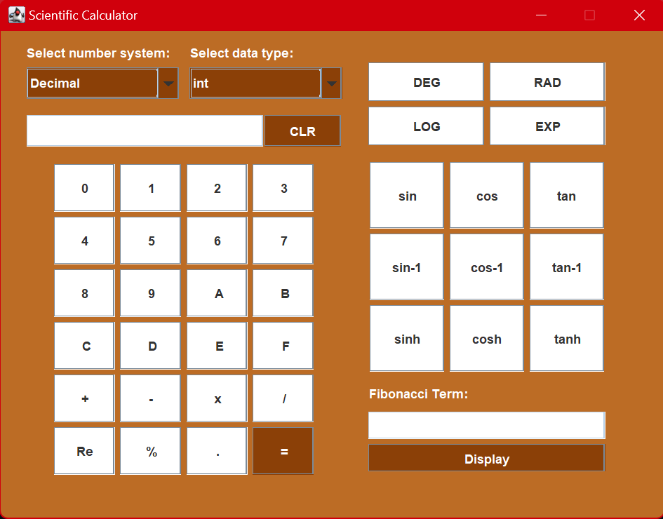

<h1 align="center">Scientific Calculator</h1>

A scientific calculator made in Java utilizing **Java Swing** and **AWT**. It allows manipulation of multiple different number systems. You can perform basic arithmetic operations, calculate trigonometric functions, find the nth fibonacci term and more!


## Features

- Multiple Number Systems:
    - Decimal
    - Binary
    - Octal
    - Hexadecimal 
- Different Datatypes
    - `int`
    - `float`
    - `double`
- Basic Arithmetic Operations
- Trignometic Functions
- Degree/Radian Toggle
- Logarithm & Exponent Calculation
- `nth` Fibonacci Term

<div align="center">
  
</div>

## Installation

Clone the project

```bash
 git clone https://github.com/mominaamjad/scientific-calculator.git
```

Go to the project directory & run
```bash
  javac Calculator.java
  java Calculator
```


## Built With

* 
* 
* 
## Lessons

Creating a GUI with Java for the first time was challenging yet rewarding. At the time, my understanding of Object-Oriented Programming was still developing, so hit-and-trial was the name of the game. This project provided me with valuable hands-on experience in building graphical user interfaces.

I gained a deeper understanding of Java's built-in functions for both basic and complex calculations. Additionally, and most importantly, I learned the importance of event handling in creating interactive applications.

